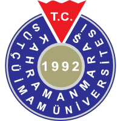

	
	<h2>Kahramanmaraş Sütçü İmam Üni. Bilgisayar Mühendisliği</h2>

Soldaki menüden derslerin listesini bulabilirsiniz. Sağ üstteki arama kutusundan da ders isimlerini veya dosyaların içerisindeki kelimelerden arama yapabilirsiniz.

## Hakkında

Bu proje [Ahmad Al Maaz](https://www.news47ell.com) tarafından sağlanmıştır ve [Ali İhsan Türkmenoğlu](https://github.com/ihsanturk) tarafından yazılmıştır.
Bu sayfadaki dersler Kahramanmaraş Sütçü İmam Üniversitesi'nde verilmiştir.

## Tüm dosyalar:

* [Sinif1](#)
  * [Bahar](#)
    * [Ders](#)
      * [Programlama](#)
        * [Hafta1](#)
          * [İkinci Dereceden Denklem Çöz](Sinif1/Bahar/Ders/Programlama/Hafta1/ikinci_dereceden_denklem.cpp.md)
          * [Kullanıcıdan Sayı Alma](Sinif1/Bahar/Ders/Programlama/Hafta1/ilk.cpp.md)
          * [Değişken Tipleri](Sinif1/Bahar/Ders/Programlama/Hafta1/veri_tipleri.cpp.md)
        * [Hafta2](#)
          * [Diziler](Sinif1/Bahar/Ders/Programlama/Hafta2/diziler_giris.cpp.md)
        * [Hafta3](#)
          * [String](#)
            * [String](Sinif1/Bahar/Ders/Programlama/Hafta3/String/stringler.cpp.md)
            * [Şifre Kontrolü](Sinif1/Bahar/Ders/Programlama/Hafta3/String/string_ornekler.cpp.md)
          * [Pointer](Sinif1/Bahar/Ders/Programlama/Hafta3/pointerlar_giris.cpp.md)
          * [Structure](Sinif1/Bahar/Ders/Programlama/Hafta3/__yarim__structurelar.cpp.md)
        * [Hafta4](#)
          * [Sınıf İle Koordinat Düzlemi](Sinif1/Bahar/Ders/Programlama/Hafta4/siniflar_giris.cpp.md)
        * [Hafta5](#)
          * [String Sınıfı](Sinif1/Bahar/Ders/Programlama/Hafta5/stringler_icin_class.cpp.md)
          * [Yapıcı Fonksiyon](Sinif1/Bahar/Ders/Programlama/Hafta5/yapici_fonksiyonlar.cpp.md)
        * [Hafta6](#)
          * [Operatör Overloading](Sinif1/Bahar/Ders/Programlama/Hafta6/karmasik_sayilar.cpp.md)
          * [String Sınıfı Operatör Overloading](Sinif1/Bahar/Ders/Programlama/Hafta6/stringler_ve_operatorler.cpp.md)
        * [Hafta7](#)
          * [Sınıf ve Kalıtım Teorik](Sinif1/Bahar/Ders/Programlama/Hafta7/kalitim.cpp.md)
          * [Sınıf ve Kalıtım](Sinif1/Bahar/Ders/Programlama/Hafta7/kalitim_ornek.cpp.md)
        * [Hafta8](#)
          * [Dosya_Islemleri](#)
            * [Dosya İşlemleri](Sinif1/Bahar/Ders/Programlama/Hafta8/Dosya_Islemleri/dosya_islemleri.cpp.md)
            * [Stringleri İçindeki Bir Karakterle Parçalara Ayır](Sinif1/Bahar/Ders/Programlama/Hafta8/Dosya_Islemleri/stringleri_ayir.cpp.md)
        * [Hafta9](#)
          * [header_dosyalari](#)
            * [Çok Biçimlilik, Header Dosyaları](Sinif1/Bahar/Ders/Programlama/Hafta9/header_dosyalari/main.cpp.md)
            * 
          * [Try, Catch](Sinif1/Bahar/Ders/Programlama/Hafta9/try_catch_hata_yakala.cpp.md)
    * [Uygulama](#)
      * [Carsamba](#)
        * [Fahriye_Hoca](#)
          * [lab3](#)
            * [Nesne Overloading Fahriye Hoca](Sinif1/Bahar/Uygulama/Carsamba/Fahriye_Hoca/lab3/nesne_overloading_fahriye_hoca.cpp.md)
        * [Zeynep_Hoca](#)
          * [Kalıtım Hastalık Teşhisi Başarı Oranı Zeynep Hoca](Sinif1/Bahar/Uygulama/Carsamba/Zeynep_Hoca/zeynep_hoca_kalitim_hastalik_teshis_sistemi.cpp.md)
        * [Çember Sınıfı](Sinif1/Bahar/Uygulama/Carsamba/cember.cpp.md)
        * [Dosya İşlemleri Sınıfı](Sinif1/Bahar/Uygulama/Carsamba/dosya_islemleri.cpp.md)
        * [Kalıtım Hastalık Teşhisi Başarı Oranı](Sinif1/Bahar/Uygulama/Carsamba/kalitim_hastalik_teshis_sistemi.cpp.md)
        * [Overloading Saat Sınıfı](Sinif1/Bahar/Uygulama/Carsamba/overload.cpp.md)
        * [Tam Bölünenleri Bul](Sinif1/Bahar/Uygulama/Carsamba/tam_bolunenleri_bul.cpp.md)
        * [Üçgen Sınıfı](Sinif1/Bahar/Uygulama/Carsamba/ucgen.cpp.md)
      * [Persembe](#)
        * [C++ ile Asal Sayılar](Sinif1/Bahar/Uygulama/Persembe/asal_sayilar.cpp.md)
        * [C ile Asal Sayılar](Sinif1/Bahar/Uygulama/Persembe/asal_sayilar.c.md)
        * [Asal Sayılar Zeynep Hoca](Sinif1/Bahar/Uygulama/Persembe/asal_sayilar_zeynep_hoca.cpp.md)
        * [Dosya İşlemleri Sınıfı](Sinif1/Bahar/Uygulama/Persembe/dosya_islemleri.cpp.md)
        * [Kutu Sınıfı](Sinif1/Bahar/Uygulama/Persembe/kutu_sinifi.cpp.md)
        * [Sıkıştırma](Sinif1/Bahar/Uygulama/Persembe/run_lenght_encoding.cpp.md)
        * [Kalıtım Zeynep Hoca](Sinif1/Bahar/Uygulama/Persembe/run_lenght_encoding_zeynpe_hoca.cpp.md)
  * [Guz](#)
    * [Ders](#)
      * [Programlama](#)
        * [Hafta1](#)
          * [Mod Hesapla](Sinif1/Guz/Ders/Programlama/Hafta1/mod_alma.c.md)
          * [Notu Harfe Çevir](Sinif1/Guz/Ders/Programlama/Hafta1/notu_harfe_cevirme.c.md)
          * [Sayıları Topla](Sinif1/Guz/Ders/Programlama/Hafta1/sayilarin_toplanmasi.c.md)
          * [Sayının Durumu Tesipt](Sinif1/Guz/Ders/Programlama/Hafta1/tek_cift_neg_poz_tespit.c.md)
        * [Hafta2](#)
          * [Sayaç Kontrollü Döngü](Sinif1/Guz/Ders/Programlama/Hafta2/sayac_kontrollu_dongu.c.md)
          * [Sentinel Kontrollü Döngü](Sinif1/Guz/Ders/Programlama/Hafta2/sentinel_kontrollu_dongu.c.md)
          * [While İle Tek Çift Belirle](Sinif1/Guz/Ders/Programlama/Hafta2/while_dongu_sayisini_belirleme.c.md)
          * [While İle Toplama İşlemi](Sinif1/Guz/Ders/Programlama/Hafta2/while_ile_toplama.c.md)
        * [Hafta3](#)
          * [Break_ve_Continue](#)
            * [While ve Break](Sinif1/Guz/Ders/Programlama/Hafta3/Break_ve_Continue/while_continue_ve_break.c.md)
          * [Do_While_Dongusu](#)
            * [Do While Döngüsü](Sinif1/Guz/Ders/Programlama/Hafta3/Do_While_Dongusu/do_while_dongusu_tanim.c.md)
            * [Do While Not Kontrolü](Sinif1/Guz/Ders/Programlama/Hafta3/Do_While_Dongusu/do_while_notu_kontrol_etme.c.md)
            * [Do While İle Limit Koy](Sinif1/Guz/Ders/Programlama/Hafta3/Do_While_Dongusu/do_while_notu_kontrol_etme_belli_sayida.c.md)
          * [For Döngüsü](Sinif1/Guz/Ders/Programlama/Hafta3/for_dongusu.c.md)
          * [For Döngüsü Maksimum Sayıyı Bul](Sinif1/Guz/Ders/Programlama/Hafta3/maksimum_sayiyi_for_fongusu_ile_bulma.c.md)
        * [Hafta4](#)
          * [Switch Case](Sinif1/Guz/Ders/Programlama/Hafta4/switch_case_giris.c.md)
          * [Switch Case Hesap Makinesi](Sinif1/Guz/Ders/Programlama/Hafta4/switch_case_hesap_makinesi_menu.c.md)
          * [Switch Case Menü](Sinif1/Guz/Ders/Programlama/Hafta4/switch_case_ornek.c.md)
        * [Hafta5](#)
          * [Faktöriyel Fonksiyonu](Sinif1/Guz/Ders/Programlama/Hafta5/faktoriyel_fonksiyonu.c.md)
          * [Fonksiyon](Sinif1/Guz/Ders/Programlama/Hafta5/fonksiyonlar_giris.c.md)
          * [Hesap Makinesi Fonksiyonu](Sinif1/Guz/Ders/Programlama/Hafta5/toplama_fonksiyonu.c.md)
        * [Hafta6](#)
          * [Not Hesaplama Fonksiyonu](Sinif1/Guz/Ders/Programlama/Hafta6/fonksiyon_not_hesaplama.c.md)
        * [Hafta7](#)
          * [Minimum Sayıyı Bul](Sinif1/Guz/Ders/Programlama/Hafta7/kucuk_olani_sayiyi_ekrana_bas.c.md)
          * [Random](Sinif1/Guz/Ders/Programlama/Hafta7/random_notlari.c.md)
          * [Yazı Tura](Sinif1/Guz/Ders/Programlama/Hafta7/yazi_tura.c.md)
          * [Zar](Sinif1/Guz/Ders/Programlama/Hafta7/zar_at.c.md)
        * [Hafta8](#)
          * [Dizi](Sinif1/Guz/Ders/Programlama/Hafta8/diziler.c.md)
          * [Karakter Dizisi](Sinif1/Guz/Ders/Programlama/Hafta8/diziler_farkli_tipler.c.md)
          * [Dizi Tanım](Sinif1/Guz/Ders/Programlama/Hafta8/diziler_giris.c.md)
          * [Karakter Dizisi Örnek](Sinif1/Guz/Ders/Programlama/Hafta8/diziler_kullanicidan_ad_soyad_numara_alma.c.md)
          * [Fonksiyon İle Dizi Al](Sinif1/Guz/Ders/Programlama/Hafta8/diziler_ve_fonksiyon.c.md)
        * [Hafta9](#)
          * [Karakter Kontrol Fonksiyonları](Sinif1/Guz/Ders/Programlama/Hafta9/karakter_fonksiyonlari.c.md)
          * [Pointerın Diğer Tiplerden Farkı](Sinif1/Guz/Ders/Programlama/Hafta9/pointerin_farki.c.md)
          * [Pointer](Sinif1/Guz/Ders/Programlama/Hafta9/pointerlar_giris.c.md)
          * [Pointer Tanımla](Sinif1/Guz/Ders/Programlama/Hafta9/pointer_ornek.c.md)
        * [Hafta10](#)
          * [Karakter_Dizileri_ve_Ctype_Kutuphanesi](#)
            * [Karakter Dizileri ve Ctype Kütüphanesi](Sinif1/Guz/Ders/Programlama/Hafta10/Karakter_Dizileri_ve_Ctype_Kutuphanesi/ctype_ile_uygulama.c.md)
            * [Ctype Kütüphanesi Fonksiyonları](Sinif1/Guz/Ders/Programlama/Hafta10/Karakter_Dizileri_ve_Ctype_Kutuphanesi/ctype_kutuphanesi.c.md)
            * [Karakter Dizileri Tip Dönüşümleri](Sinif1/Guz/Ders/Programlama/Hafta10/Karakter_Dizileri_ve_Ctype_Kutuphanesi/karakter_dizilerini_donusturme.c.md)
            * [Karakter Dizileri Karşılaştırma](Sinif1/Guz/Ders/Programlama/Hafta10/Karakter_Dizileri_ve_Ctype_Kutuphanesi/karakter_dizilerini_karsilastirma.c.md)
            * [Karakter Dizileri ile İşlemler](Sinif1/Guz/Ders/Programlama/Hafta10/Karakter_Dizileri_ve_Ctype_Kutuphanesi/karakter_dizileri_ile_islemler.c.md)
            * [Karakter Dizileri Kopyalama](Sinif1/Guz/Ders/Programlama/Hafta10/Karakter_Dizileri_ve_Ctype_Kutuphanesi/karakter_dizileri_kopyalama_islemleri.c.md)
            * [Karakter Dizisi ile Kullanıcıdan Veri Al](Sinif1/Guz/Ders/Programlama/Hafta10/Karakter_Dizileri_ve_Ctype_Kutuphanesi/tc_numarasi_al.c.md)
          * [Struct](Sinif1/Guz/Ders/Programlama/Hafta10/struct_giris.c.md)
    * [Odev](#)
      * [Kare Çiz](Sinif1/Guz/Odev/1.1_kare_ciz.c.md)
      * [Kullanıcın Sayılarını Çarp](Sinif1/Guz/Odev/1.2_sayilari_carp.c.md)
      * [Vücut Kitle Endeksi](Sinif1/Guz/Odev/2.1_vucut_kitle_endeksi_bul.c.md)
      * [Kullanıcının Sayılarının Ortalaması](Sinif1/Guz/Odev/3.1_belirsiz_sayida_girilen_notun_ortalamasi.c.md)
      * [Kullanıcının Sayılarının Maksimumu](Sinif1/Guz/Odev/4.1_kullanicidan_alinan_uc_sayinin_maksimumu.c.md)
      * [Kullanıcıdan Alınan Sayılarla İşlemler](Sinif1/Guz/Odev/4.2_kullanicidan_alinan_sayilarin_maks_ort_top.c.md)
      * [Faktöriyel](Sinif1/Guz/Odev/5.1_sayinin_faktoriyeli.c.md)
      * [Not Hesaplama](Sinif1/Guz/Odev/5.2_not_girisi_ve_harfe_donusturmesi_limitli.c.md)
      * [Kullanıcının Sayısı ile İçi Dolu Kare Oluştur](Sinif1/Guz/Odev/5.3.1_kullanicidan_alinan_degerle_dolu_kare_ciz.c.md)
      * [Kullanıcının Sayısı ile İçi Boş Kare Oluştur](Sinif1/Guz/Odev/5.3.2_kullanicidan_alinan_degerle_bos_kare_ciz.c.md)
      * [Switch Case İle Hesap Makinesi](Sinif1/Guz/Odev/6.1_switch_case_ile_menulu_hesap_makinesi.c.md)
      * [Fonksiyon İle Vücut Kitle Endeksi](Sinif1/Guz/Odev/7.1_iki_fonksiyonla_vke_hesapla.c.md)
      * [Bilgisayarın Sayısını Tahmin Et](Sinif1/Guz/Odev/7.2_belli_araliktaki_random_sayiyi_bulma_oyunu.c.md)
      * [Zar Olasılık Hesapla](Sinif1/Guz/Odev/7.3_100000_defa_iki_zar_at_cift_gelme_olasiligi_bul.c.md)
      * [Rastgele Sayılarla Dizi Oluştur](Sinif1/Guz/Odev/8.1_rastgele_100_adet_sayi_ile_dizi_olustur.c.md)
      * [Dizinin Maksimum Elemanı](Sinif1/Guz/Odev/8.2_dizinin_maksimum_elemanini_bul.c.md)
      * [Dizi Sırala](Sinif1/Guz/Odev/8.3_diziyi_buyukten_kucuge_sirala.c.md)
      * [Hesap Oluştur](Sinif1/Guz/Odev/hesap_olusturma.c.md)
    * [Uygulama](#)
      * [Kullanıcı Cevabına Göre Devam](Sinif1/Guz/Uygulama/2.1_devam_kontrolu.c.md)
      * [Sayı Basamağı Tespiti](Sinif1/Guz/Uygulama/3.1_sayi_kac_basamakli.c.md)
      * [Sayı İçinde Ara](Sinif1/Guz/Uygulama/3.2_sayi_icinde_sayi_ara.c.md)
      * [Dizi Toplamı](Sinif1/Guz/Uygulama/4.1_dizileri_topla.c.md)
      * [Dizi Alıştırma](Sinif1/Guz/Uygulama/diziler_alistirma.c.md)
